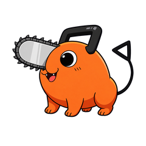

# Codex Character Cursors

把喜欢的角色做成 Windows 鼠标光标。这里可以下载已经做好的皮肤，也可以使用 Codex Skills，把自己的参考图变成一套光标。

[下载最新正式合集](https://github.com/jinhongsop-ux/codex-character-cursors/releases/latest) · [打开在线预览](https://codex-character-cursors.vercel.app)

在线页面可以切换五款角色、查看各状态、调整预览大小，并直接下载完整安装包。应用到 Windows 时，请使用下载包中的本地安装脚本和调节器。

推荐下载 **角色光标完整合集 V2.0.0**：一个 ZIP 包含五款皮肤、本地大小调节工作台、安装与恢复脚本、制作 Skills 和中文说明。完整解压后双击 **一键安装.cmd**；使用前也可运行 **检查安装包.cmd**。Releases 中的 Source code 是源码，普通使用请选择合集 ZIP。

## 成品光标

点击「完整安装包」下载，点击「状态预览」查看角色在选择、输入、等待、移动和调整窗口大小等状态下的样子。

| 角色 | 基础形象 | 完整安装包 | 状态预览 |
|---|:---:|---|---|
| 蕾塞 · V1.5 |  | [下载](packs/蕾塞光标-Windows-V1.5.zip) | [查看](previews/reze.png) |
| 蕾姆 · V1.2.1 |  | [下载](packs/RemCursor-Windows-v1.2.1.zip) | [查看](previews/rem.png) |
| deepseek酱 · V1.5 |  | [下载](packs/deepseek酱光标-样本-V1.5.zip) | [查看](previews/deepseek.png) |
| Pochita Mini · V1.5 |  | [下载](packs/Pochita-Mini光标-V1.5.zip) | [查看](previews/pochita.png) |
| Zero Two（零二）· V1.5 |  | [下载](packs/ZeroTwo-Q版光标-Windows-V1.5.zip) | [查看](previews/pink-horn.png) |

### 怎么使用

1. 下载喜欢的角色安装包，**完整解压**到一个文件夹。
2. 双击包内的 **一键安装.cmd**，按提示应用光标。
3. 想换回系统光标时，运行包内的恢复脚本。具体选项见随包的使用说明。

不同安装包的恢复选项有所区别：「恢复系统默认」切换到系统白色默认方案；「恢复安装前配置」还原备份。蕾姆旧版的「一键恢复原状」使用安装前备份。

## 调整光标大小

[下载最新完整合集](https://github.com/jinhongsop-ux/codex-character-cursors/releases/latest)

正式合集的工作台在本机浏览器中打开，内置**蕾塞、蕾姆、deepseek酱、Pochita Mini、Zero Two（零二）**。可以切换角色、查看深浅背景下的效果，输入 **16–256 像素**的大小，再点击 **应用到系统**。

五款角色在同一个工作台中调整。上方表格保留各角色独立包的下载链接；需要完整功能时，优先使用正式合集。

### 安装工作台

1. 完整解压工作台安装包，双击 **一键安装.cmd**。
2. 网页打开后，选择角色和大小，点击 **应用到系统**。
3. 以后从开始菜单打开「角色光标工作台」即可，安装后可以删除下载包的解压文件夹。

也可以双击 **启动光标工作台.cmd** 便携运行；这种方式需要保留解压文件夹。使用工作台无需安装 Python 或 Node，也不需要联网，运行环境为 Windows 10/11 和 .NET Framework。

大小数字表示**整个光标画布的屏幕物理像素**，包含透明留白，人物本身会比这个数字小。角色素材是位图，放大后细节会受到原始素材分辨率的限制。

### 换回系统光标

工作台提供两种一键恢复脚本，也可以用于其他角色光标包：

- **一键恢复系统默认.cmd**：恢复系统白色默认方案和默认大小。
- **一键恢复系统白色小号.cmd**：切换到 24×24 像素的白色小号光标。

这两种选项都会清除残留的额外放大倍率。白色小号是自定义尺寸，与系统默认尺寸不同。

### 网页没有打开？

请先确认安装包已完整解压，使用包内配套的脚本和程序。浏览器无法自动打开时，启动提示会提供本地网页地址，可复制到浏览器访问。

安装错误可查看 `%LOCALAPPDATA%\CharacterCursorStudio\install-log.txt`；启动错误可查看同目录的 `launch-log.txt`。重新登录后若大小变化，打开工作台重新应用即可。

## 用自己的角色制作光标

仓库提供两个 [Codex Skills](skills)。将对应文件夹复制到自己的 Codex skills 目录，通常是 `~/.codex/skills/`。

正式合集内也提供 **安装制作Skills.cmd**，可一键安装这两个 Skills，更新同名版本。

| Skill | 用途 |
|---|---|
| [character-chibi-prep](skills/character-chibi-prep/SKILL.md) | 把动漫、漫画等非 Q 版参考角色转换为 2D Q 版基础形象。 |
| [character-cursor-pack](skills/character-cursor-pack/SKILL.md) | 制作角色光标，输出 16 项状态贴图、17 个 Windows 光标角色映射、预览和中文安装包。 |

上传参考图后，可以对 Codex 说：

> 使用 $character-chibi-prep 把这个角色转换成 Q 版，确认形象后，再使用 $character-cursor-pack 制作 Windows 光标皮肤。

已经有 Q 版形象或完整状态图时，可以直接调用 `$character-cursor-pack`。需要保留状态图原色时，指定使用裁切和透明蒙版，跳过 AI 重绘。

制作过程使用 Codex 图像工具及本地构建工具；本地构建需要 Python 和 Pillow。下载成品使用无需这些工具。

## 源码与文件校验

工作台源码在 [studio](studio)，Skills 和配套工具在 [skills](skills)。在 Windows PowerShell 中构建工作台：

```powershell
powershell -NoProfile -ExecutionPolicy Bypass -File .\studio\tests\build.ps1
```

构建结果位于 `studio/package`。安装包的 SHA-256 校验值见 [SHA256SUMS.txt](SHA256SUMS.txt)。

## 素材说明

角色 IP 和第三方原图的权利属于各自权利人。案例用于展示制作效果，不代表商业分发授权。项目当前未指定开源许可证。
